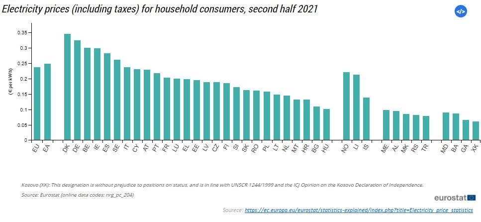

### Energy_Management_Dashboard
Can you believe, Germany has the 2nd highest electricity price (both for household and non-household) within European Union (EU) and tends to increase each year compared to the previous one! 

Energy cost can depend on various complicated matters, e.g: the prices of fuels, demand and supply regulations, geopolitical situation, weather conditions and transmission and distribution system etc., over which we have too little control as a consumer!
But as an aware citizen, what we can do, is to limit energy waste and to cut back our energy bill, thus saving money. Yes, it is not enough just to install all modern smart gadgets. To have a control over our energy usage and to change our energy consumption habits and therefore improve overall efficiency, it’s also important to understand and pinpoint areas where we're using more energy than you need to.

Therefore, came the motivation of the project. I introduce you my energy management dashboard, which can be integrated with any smart home app, to assist users to understand, what exactly they are paying for and their consumption behavior. 

This dashboard is built with the help of python in streamlit and the visualizations are made with open-source Python library holoviews. The reason I’ve chosen Holoviews, because it can produce more playful and interactive plots (consumers can zoom in, zoom out and directly save the graphs into their device), which can be engaging and interesting for the consumer and can work with other backends like matplotlib, seaborn and bokeh. The link to my dashboard is [here](https://share.streamlit.io/yousrajaf/energy_management-dashboard/main/energy_dashboard.py)

The individual dataset that I’ve working with, is collected from the University of Massachusetts smart home repository, which aims to facilitate research on energy consumption optimization in modern 'smart homes'. It is a Time-Series data for a period of three years, fetched from a smart meter, taht represents an anonymous homes' smart meters, including electrical (usage and generation), and environmental data (e.g., temperature and humidity) for a period of three years. 

In case you’re wondering, what is a time-series data and a smart meter? 
So, there is cross sectional data, where indexing variables, as well as variable of interest or target variable and a variety of other variables are present, that may or may not influence our target variable. For example, if the indexing is an independent collection of observation, e.g.: independent customer id, independent stores_id, independent city_id, then we are dealing with cross sectional data.
But when this indexing variable is dependent on time, or the indexing is time itself, we call it **time series data**.
And a **smart meter** is a IoT device, very similar to the traditional meter in our home, that measures and records energy consumption data. However, the smart meter differs because it’s a digital device that can communicate remotely with your utilities. It will send consumption information of our utility, at whichever time span we choose and eliminates the need for a meter reader.

Along with this Energy Management Dashboard, I’ve added sub features, like: “Uses by rooms and appliances”. So, right now, I’m dealing with one anonymous homes' smart meters data, but imagine, If it can be established with a smart home app, where you can compare different users consumption and calculate an optimal average consumption or an ideal threshold of total consumption and give a feedback to the consumer, if they are using above this threshold on not, don’t you think, as a consumer it will be very insightful if they’re using more than the optimal level and where exactly they should cut down consumption or take different steps!

Later, with the help of machine learning: I also intend to predict household overall energy consumption. :smiley:

If you think, we liked what you saw, then please let me know through an email, as a token of your appreciation! :pray: :grin:

Connect with me on [linkedin](https://www.linkedin.com/in/jafrin-hossain/)!
